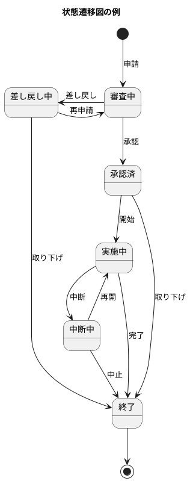
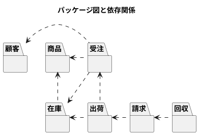
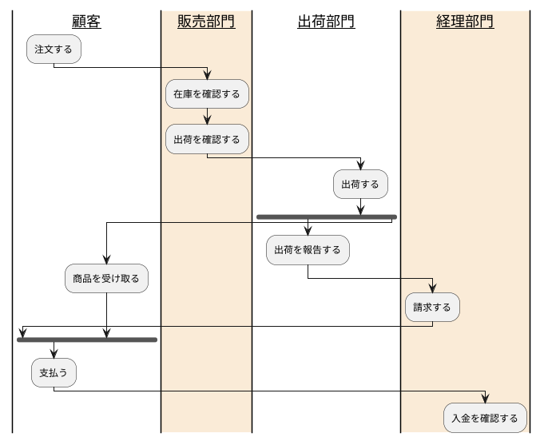

## Sample2
一般的に利用されているMarkdwon記法（GitHub Flavored With Markdown）では表現しきれない複雑な表現を実現するために、機能を拡張しています。

### セルの結合
| headerA | headerB |
| :---:   | :---:   |
| cellA   | cellB   |
| >       | cellD   |
| cellE   | cellF   |
| cellG   | ^       |

### LateX記法
$$f(t) = \displaystyle\int_{-\infty}^{\infty}g(x)(\cos(2\pi xt)+j\sin(2\pi xt))dx$$

### メモ・ヒント・注意・警告

> [!note]
> hogehoge

---

> [!tip]
> hogehoge

---

> [!warning]
> hogehoge

---

> [!danger]
> hogehoge

### PlantUMLによる製図

